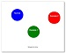

# Leap 2022 Aqua Yalalt
Leap 2022 хөтөлбөрийн Aqua ангийн суралцагч. Repository with assignment lesson
**Assignment links**
**Javascript даалгаврууд**

1. Basic Javascript
- Code links: https://github.com/Yalalt/Leap-Aqua-Yalaltg/tree/main/js/basic/
- Code links: https://github.com/Yalalt/Leap-Aqua-Yalaltg/tree/main/js/basic/inputs/
- Дугуйн тойрог, талбай: https://yalalt.github.io/Leap-Aqua-Yalaltg/js/basic/inputs/index.html

2. **Team A B onoo check**
- Code links: https://github.com/Yalalt/Leap-Aqua-Yalaltg/tree/main/js/basic/condition/team/main.js
3. **Max min number oloh bodlogo**
- Code links: https://github.com/Yalalt/Leap-Aqua-Yalaltg/tree/main/js/basic/condition/maxNumber/main.js
4. **Cурагчдын дүн үнэлгээг харуулах**
- Code links: https://github.com/Yalalt/Leap-Aqua-Yalaltg/tree/main/js/basic/condition/dununelgee/
- Open Page: https://yalalt.github.io/Leap-Aqua-Yalaltg/js/basic/condition/dununelgee/index.html
5. **Өндөр жилийг мөн бишийг харуулах**
- Code links: https://github.com/Yalalt/Leap-Aqua-Yalaltg/tree/main/js/basic/condition/leafyear/
- Open Page: https://yalalt.github.io/Leap-Aqua-Yalaltg/js/basic/condition/leafyear/index.html
6. **Хоолны үнэнд ноогдох татвар бодож харуулах**
- Code links: https://github.com/Yalalt/Leap-Aqua-Yalaltg/tree/main/js/basic/condition/orgil-bagsh/
- Open Page: https://yalalt.github.io/Leap-Aqua-Yalaltg/js/basic/condition/orgil-bagsh/index.html
7. **4 input number's Min number бодож харуулах**
- Code links: https://github.com/Yalalt/Leap-Aqua-Yalaltg/tree/main/js/basic/condition/fourNumberMin/main.js
- Open Page: https://yalalt.github.io/Leap-Aqua-Yalaltg/js/basic/condition/fourNumberMin/index.html
8. **2 toonii hoorondoh too generate hiij oloh**
- Code links: https://github.com/Yalalt/Leap-Aqua-Yalaltg/tree/main/js/basic/condition/randomNumbers/main.js
- Open Page: https://yalalt.github.io/Leap-Aqua-Yalaltg/js/basic/condition/randomNumbers/index.html
9. **Temuulen Narmandakh bagshiin Easy assignment - бодлогууд**
- Code links: https://github.com/Yalalt/Leap-Aqua-Yalaltg/tree/main/js/basic/condition/temuulenNarmandakh/dun.js
- Open Page: https://yalalt.github.io/Leap-Aqua-Yalaltg/js/basic/condition/temuulenNarmandakh/index.html
10. **3 тооны нийлбэр олох assignment 999**
- Code links: https://github.com/Yalalt/Leap-Aqua-Yalaltg/tree/main/js/basic/condition/threeNumbersadd/main.js
- Open Page: https://yalalt.github.io/Leap-Aqua-Yalaltg/js/basic/condition/threeNumbersadd/index.html

--------------------------

1. **Bootstrap дээр хийсэн Байгууллагын судалгаа**
- 
- Github file location: ["../bootstrap/org-sudalgaa/"](https://github.com/Yalalt/Leap-Aqua-Yalaltg/tree/main/bootstrap/org-sudalgaa/)
- open Github Pages: [https://yalalt.github.io/Leap-Aqua-Yalaltg/bootstrap/org-sudalgaa/index.html](https://yalalt.github.io/Leap-Aqua-Yalaltg/bootstrap/org-sudalgaa/index.html)

2. **Bootstrap дээр хийсэн responsive web хийх даалгаврын**
- File location on Github: [Github file location](https://github.com/Yalalt/Leap-Aqua-Yalaltg/blob/main/bootstrap/responsive-web/index.html)click me
- open Github Pages: [Github Pages](https://yalalt.github.io/Leap-Aqua-Yalaltg/bootstrap/responsive-web/index.html)click me 

3. **We Promote for Career - Bootstrap дээр хийх даалгаврын:**
- File location link: [open Github source code](https://github.com/Yalalt/Leap-Aqua-Yalaltg/tree/main/bootstrap/promote-career)
- Deploy web link: [open Github Pages](https://yalalt.github.io/Leap-Aqua-Yalaltg/bootstrap/promote-career/index.html)

4. **Color rows using Bootstrap Даалгавар:**
- File location link: [open Github source code](https://github.com/Yalalt/Leap-Aqua-Yalaltg/tree/main/bootstrap/color-rows)
- open Github Pages: [open Github Pages](https://yalalt.github.io/Leap-Aqua-Yalaltg/bootstrap/color-rows/index.html)

5. **Admin хэсэгтэй Ангилал нэмэх хасах хэсгийг хийв**
- File location link: [open Github source code](https://github.com/Yalalt/Leap-Aqua-Yalaltg/blob/main/bootstrap/admin/index.html)
- open Github Pages: https://yalalt.github.io/Leap-Aqua-Yalaltg/bootstrap/admin/index.html

6. **Sign In цонх** 
- File location link: [open Github source code](https://github.com/Yalalt/Leap-Aqua-Yalaltg/tree/main/bootstrap/sign-in)
- open Github Pages: https://yalalt.github.io/Leap-Aqua-Yalaltg/bootstrap/sign-in/index.html  

7. **Moon picture overlay on card assignment:**
- File location link: [open Github source code](https://github.com/Yalalt/Leap-Aqua-Yalaltg/tree/main/bootstrap/moon)
- open Github Pages: https://yalalt.github.io/Leap-Aqua-Yalaltg/bootstrap/moon/index.html  

8. **Three color bg-тэй Card assignment:**
- File location link: [open Github source code](https://github.com/Yalalt/Leap-Aqua-Yalaltg/tree/main/bootstrap/cardy)
- open Github Pages: https://yalalt.github.io/Leap-Aqua-Yalaltg/bootstrap/cardy/index.html  

9. **Showcase assignment хэсгийг харах бол:**
- File location link: [open Github source code](https://github.com/Yalalt/Leap-Aqua-Yalaltg/tree/main/bootstrap/showcase)
- open Github Pages: https://yalalt.github.io/Leap-Aqua-Yalaltg/bootstrap/showcase/index.html

10. **Banner assignment хэсгийг харах бол:**
- File location link: [open Github source code](https://github.com/Yalalt/Leap-Aqua-Yalaltg/blob/main/bootstrap/responsive-web/banner/index.html)
- open Github Pages: https://yalalt.github.io/Leap-Aqua-Yalaltg/bootstrap/responsive-web/banner/index.html

----------------

18. **Responsive Card хийх даалгавар**
- 
- Github on file location: https://github.com/Yalalt/Leap-Aqua-Yalaltg/blob/main/responsive-css/card/
- open Github on Pages link: https://yalalt.github.io/Leap-Aqua-Yalaltg/responsive-css/card/index.html

17. **Slack web design**, **Media Query ашиглан Slack-ийн Design-д media query бичиж, design өөрчлөх EXAMPLE - 4 даалгавар**
- Github on file location: https://github.com/Yalalt/Leap-Aqua-Yalaltg/blob/main/responsive-css/mediaquery/slack/
- open Github on Pages link: https://yalalt.github.io/Leap-Aqua-Yalaltg/responsive-css/mediaquery/slack/index.html

16. **Air Ballon - Агаарын бөмбөлөг зурагтай даалгавар**, **Media Query ашиглан Web-ийн Design-д media query бичиж, design өөрчлөх EXAMPLE - 3 даалгавар**
- Github on file location: https://github.com/Yalalt/Leap-Aqua-Yalaltg/blob/main/responsive-css/mediaquery/zuragtai/
- open Github on Pages link: https://yalalt.github.io/Leap-Aqua-Yalaltg/responsive-css/mediaquery/zuragtai/index.html

15. **Media Query ашиглан Web-ийн Design-д media query бичиж, design өөрчлөх EXAMPLE - 2 даалгавар**
- Github on file location: https://github.com/Yalalt/Leap-Aqua-Yalaltg/blob/main/responsive-css/challenge/mediaquery-example/
- open Github on Pages link: https://yalalt.github.io/Leap-Aqua-Yalaltg/responsive-css/challenge/mediaquery-example/index.html

14. **Media Query ашиглан Web-ийн Design, media query бичиж, design өөрчлөх даалгавар**
- Github on file location: https://github.com/Yalalt/Leap-Aqua-Yalaltg/blob/main/responsive-css/challenge/responsive-blue-main/
- open Github on Pages link: https://yalalt.github.io/Leap-Aqua-Yalaltg/responsive-css/challenge/responsive-blue-main/index.html

13. **Media Query ашиглан background color, background media size text өөрчилж хийх даалгавар**
- Github on file location: https://github.com/Yalalt/Leap-Aqua-Yalaltg/blob/main/responsive-css/challenge/mediaqueryback/
- open Github on Pages link: https://yalalt.github.io/Leap-Aqua-Yalaltg/responsive-css/challenge/mediaqueryback/index.html

12. **Цэнхэр цагаан хэсэгтэй холбоо барих форум ба бүртгэлийн хэсгийг хийх даалгавар**
- Github on file location: https://github.com/Yalalt/Leap-Aqua-Yalaltg/blob/main/responsive-css/challenge/formbluewhite/
- open Github on Pages link: https://yalalt.github.io/Leap-Aqua-Yalaltg/responsive-css/challenge/formbluewhite/index.html

11. **Photos Hover Transition transform харах бол:**
- 
- File location link: [open Github source code](https://github.com/Yalalt/Leap-Aqua-Yalaltg/blob/main/responsive-css/challenge/box-transform/)
- open Github Pages: [https://yalalt.github.io/Leap-Aqua-Yalaltg/responsive-css/challenge/box-transform/index.html](https://yalalt.github.io/Leap-Aqua-Yalaltg/responsive-css/challenge/box-transform/index.html)

10. **HTML CSS u li ашиглан Menu хийх hover дээр effect оруулах даалгавар**
- Github on file location: https://github.com/Yalalt/Leap-Aqua-Yalaltg/blob/main/responsive-css/challenge/menu-howwer/
- open Github on Pages link: https://yalalt.github.io/Leap-Aqua-Yalaltg/responsive-css/challenge/menu-howwer/index.html

9. **HTML CSS ашиглан 3 дугуйг transition хийх даалгавар**
- 
- Github on file location: https://github.com/Yalalt/Leap-Aqua-Yalaltg/blob/main/responsive-css/challenge/galaxy/
- open Github on Pages link: https://yalalt.github.io/Leap-Aqua-Yalaltg/responsive-css/challenge/galaxy/index.html

8. **HTML CSS ашиглан Search Bar Input хийх даалгавар**
- Github on file location: https://github.com/Yalalt/Leap-Aqua-Yalaltg/blob/main/responsive-css/challenge/searchinput/
- open Github on Pages link: https://yalalt.github.io/Leap-Aqua-Yalaltg/responsive-css/challenge/searchinput/index.html

7. **HTML CSS ашиглан Floaty Four Box transform хийх даалгавар**
- Github on file location: https://github.com/Yalalt/Leap-Aqua-Yalaltg/blob/main/responsive-css/challenge/box4expand/
- open Github on Pages link: https://yalalt.github.io/Leap-Aqua-Yalaltg/responsive-css/challenge/box4expand/index.html

6. **HTML CSS ашиглан далд ордог Sidebar Menu хийх даалгавар**
- 
- Github on file location: https://github.com/Yalalt/Leap-Aqua-Yalaltg/blob/main/responsive-css/challenge/sidebar-hovermenu/
- open Github on Pages link: https://yalalt.github.io/Leap-Aqua-Yalaltg/responsive-css/challenge/sidebar-hovermenu/index.html

5. **HTML CSS ашиглан hover Hello World Button хийх даалгавар**
- 
- Github on file location: https://github.com/Yalalt/Leap-Aqua-Yalaltg/blob/main/responsive-css/challenge/helloworldbutton/
- open Github on Pages link: https://yalalt.github.io/Leap-Aqua-Yalaltg/responsive-css/challenge/helloworldbutton/index.html

4. **HTML CSS ашиглан санал хүсэлт авах Form хийх даалгавар**
- Github on file location: https://github.com/Yalalt/Leap-Aqua-Yalaltg/blob/main/responsive-css/challenge/form/
- open Github on Pages link: https://yalalt.github.io/Leap-Aqua-Yalaltg/responsive-css/challenge/form/index.html

3. **HTML CSS ашиглан бүртгүүлэх Form хийх даалгавар**
- Github on file location: https://github.com/Yalalt/Leap-Aqua-Yalaltg/blob/main/responsive-css/challenge/hiform/
- open Github on Pages link: https://yalalt.github.io/Leap-Aqua-Yalaltg/responsive-css/challenge/hiform/index.html

2. **Toggle Button transition transform ашиглан хийв:**
- 
- File location link-image
- [Github file location](https://github.com/Yalalt/Leap-Aqua-Yalaltg/blob/main/responsive-css/challenge/toggleButton/)
- open Github Pages: [https://yalalt.github.io/Leap-Aqua-Yalaltg/responsive-css/challenge/box-transform/index.html](https://yalalt.github.io/Leap-Aqua-Yalaltg/responsive-css/challenge/toggleButton/index.html)

1. **Social media Санал асуулгын форм хэсгийг харах бол:**
- 
- File location link: [open Github source code](https://github.com/Yalalt/Leap-Aqua-Yalaltg/blob/main/responsive-css/register-page)
- open Github Pages: [https://yalalt.github.io/Leap-Aqua-Yalaltg/responsive-css/register-page/index.html](https://yalalt.github.io/Leap-Aqua-Yalaltg/responsive-css/register-page/index.html)

0. Media Query ашиглан хийх зургийн галлери хийх даалгавар.
CodeHS дээрх байршил: https://challenge-1-html-respo-5476976.codehs.me/index.html
