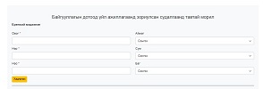
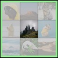
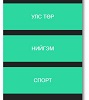

# Leap 2022 Aqua Yalalt
Leap 2022 хөтөлбөрийн Aqua ангийн суралцагч. Repository with assignment lesson
* **Assignment links**

1. **Bootstrap дээр хийсэн Байгууллагын судалгаа**
- 
- Github file location: ["../bootstrap/org-sudalgaa/"](https://github.com/Yalalt/Leap-Aqua-Yalaltg/tree/main/bootstrap/org-sudalgaa/)
- open Github Pages: [https://yalalt.github.io/Leap-Aqua-Yalaltg/bootstrap/org-sudalgaa/index.html](https://yalalt.github.io/Leap-Aqua-Yalaltg/bootstrap/org-sudalgaa/index.html)

2. **Bootstrap дээр хийсэн responsive web хийх даалгаврын**
- File location on Github: [Github file location](https://github.com/Yalalt/Leap-Aqua-Yalaltg/blob/main/bootstrap/responsive-web/index.html)click me
- open Github Pages: [Github Pages](https://yalalt.github.io/Leap-Aqua-Yalaltg/bootstrap/responsive-web/index.html)click me 

3. **We Promote for Career - Bootstrap дээр хийх даалгаврын:**
- File location link: [open Github source code](https://github.com/Yalalt/Leap-Aqua-Yalaltg/tree/main/bootstrap/promote-career)
- Deploy web link: [open Github Pages](https://yalalt.github.io/Leap-Aqua-Yalaltg/bootstrap/promote-career/index.html)

4. **Color rows using Bootstrap Даалгавар:**
- File location link: [open Github source code](https://github.com/Yalalt/Leap-Aqua-Yalaltg/tree/main/bootstrap/color-rows)
- open Github Pages: [open Github Pages](https://yalalt.github.io/Leap-Aqua-Yalaltg/bootstrap/color-rows/index.html)

5. **Admin хэсэгтэй Ангилал нэмэх хасах хэсгийг хийв**
- File location link: [open Github source code](https://github.com/Yalalt/Leap-Aqua-Yalaltg/blob/main/bootstrap/admin/index.html)
- open Github Pages: https://yalalt.github.io/Leap-Aqua-Yalaltg/bootstrap/admin/index.html

6. **Sign In цонх** 
- File location link: [open Github source code](https://github.com/Yalalt/Leap-Aqua-Yalaltg/tree/main/bootstrap/sign-in)
- open Github Pages: https://yalalt.github.io/Leap-Aqua-Yalaltg/bootstrap/sign-in/index.html  

7. **Moon picture overlay on card assignment:**
- File location link: [open Github source code](https://github.com/Yalalt/Leap-Aqua-Yalaltg/tree/main/bootstrap/moon)
- open Github Pages: https://yalalt.github.io/Leap-Aqua-Yalaltg/bootstrap/moon/index.html  

8. **Three color bg-тэй Card assignment:**
- File location link: [open Github source code](https://github.com/Yalalt/Leap-Aqua-Yalaltg/tree/main/bootstrap/cardy)
- open Github Pages: https://yalalt.github.io/Leap-Aqua-Yalaltg/bootstrap/cardy/index.html  

9. **Showcase assignment хэсгийг харах бол:**
- File location link: [open Github source code](https://github.com/Yalalt/Leap-Aqua-Yalaltg/tree/main/bootstrap/showcase)
- open Github Pages: https://yalalt.github.io/Leap-Aqua-Yalaltg/bootstrap/showcase/index.html

10. **Banner assignment хэсгийг харах бол:**
- File location link: [open Github source code](https://github.com/Yalalt/Leap-Aqua-Yalaltg/blob/main/bootstrap/responsive-web/banner/index.html)
- open Github Pages: https://yalalt.github.io/Leap-Aqua-Yalaltg/bootstrap/responsive-web/banner/index.html

11. **Social media Санал асуулгын форм хэсгийг харах бол:**

- 
- File location link: [open Github source code](https://github.com/Yalalt/Leap-Aqua-Yalaltg/blob/main/responsive-css/register-page)
- open Github Pages: [https://yalalt.github.io/Leap-Aqua-Yalaltg/responsive-css/register-page/index.html](https://yalalt.github.io/Leap-Aqua-Yalaltg/responsive-css/register-page/index.html)

12. **Photos Hover Transition transform харах бол:**
- 
- File location link: [open Github source code](https://github.com/Yalalt/Leap-Aqua-Yalaltg/blob/main/responsive-css/challenge/box-transform/)
- open Github Pages: [https://yalalt.github.io/Leap-Aqua-Yalaltg/responsive-css/challenge/box-transform/index.html](https://yalalt.github.io/Leap-Aqua-Yalaltg/responsive-css/challenge/box-transform/index.html)

13. **Toggle Button transition transform ашиглан хийв:**
- 
- File location link-image
- [Github file location](https://github.com/Yalalt/Leap-Aqua-Yalaltg/blob/main/responsive-css/challenge/toggleButton/)
- open Github Pages: [https://yalalt.github.io/Leap-Aqua-Yalaltg/responsive-css/challenge/box-transform/index.html](https://yalalt.github.io/Leap-Aqua-Yalaltg/responsive-css/challenge/toggleButton/index.html)

14. **HTML CSS ашиглан санал хүсэлт авах Form хийх даалгавар**
- Github on file location: https://github.com/Yalalt/Leap-Aqua-Yalaltg/blob/main/responsive-css/challenge/form/
- open Github on Pages link: https://yalalt.github.io/Leap-Aqua-Yalaltg/responsive-css/challenge/form/index.html

15. **HTML CSS ашиглан бүртгүүлэх Form хийх даалгавар**
- Github on file location: https://github.com/Yalalt/Leap-Aqua-Yalaltg/blob/main/responsive-css/challenge/hiform/
- open Github on Pages link: https://yalalt.github.io/Leap-Aqua-Yalaltg/responsive-css/challenge/hiform/index.html

16. **HTML CSS ашиглан hover Hello World Button хийх даалгавар**
- 
- Github on file location: https://github.com/Yalalt/Leap-Aqua-Yalaltg/blob/main/responsive-css/challenge/helloworldbutton/
- open Github on Pages link: https://yalalt.github.io/Leap-Aqua-Yalaltg/responsive-css/challenge/helloworldbutton/index.html

17. **HTML CSS ашиглан далд ордог Sidebar Menu хийх даалгавар**
- 
- Github on file location: https://github.com/Yalalt/Leap-Aqua-Yalaltg/blob/main/responsive-css/challenge/sidebar-hovermenu/
- open Github on Pages link: https://yalalt.github.io/Leap-Aqua-Yalaltg/responsive-css/challenge/sidebar-hovermenu/index.html
-